# Section 2: Architecture Diagrams — NexusTrack (AtomQuest GoalPortal)

> **Project:** NexusTrack GoalPortal · **Stack:** React + TanStack Router (Vite) · Node.js/Express · MongoDB Atlas  
> **Date:** May 19, 2026

---

## 2.1 Class Diagram

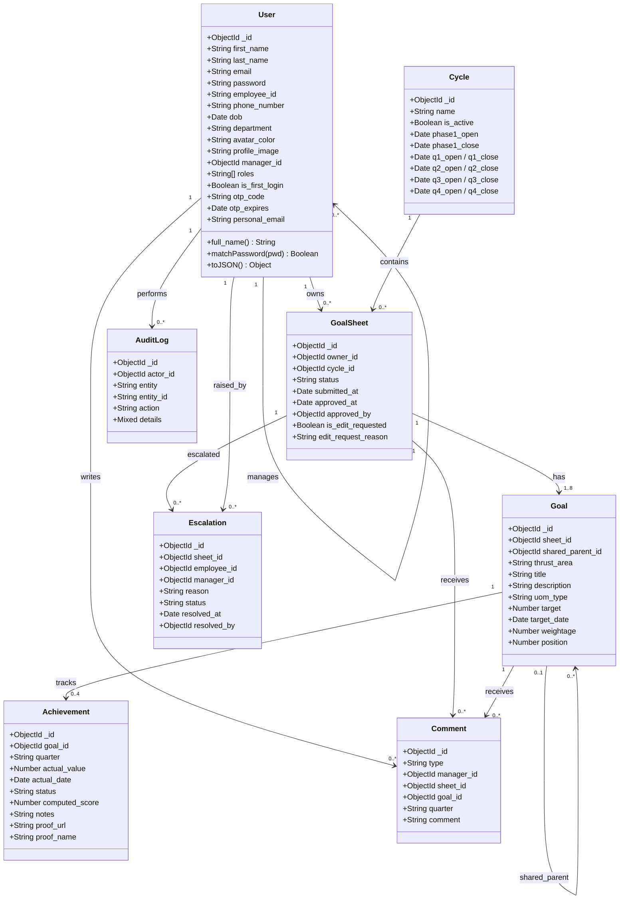

---

## 2.2 Component Diagram

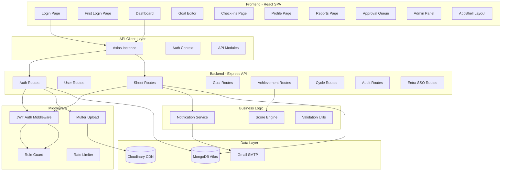

---

## 2.3 Deployment Diagram

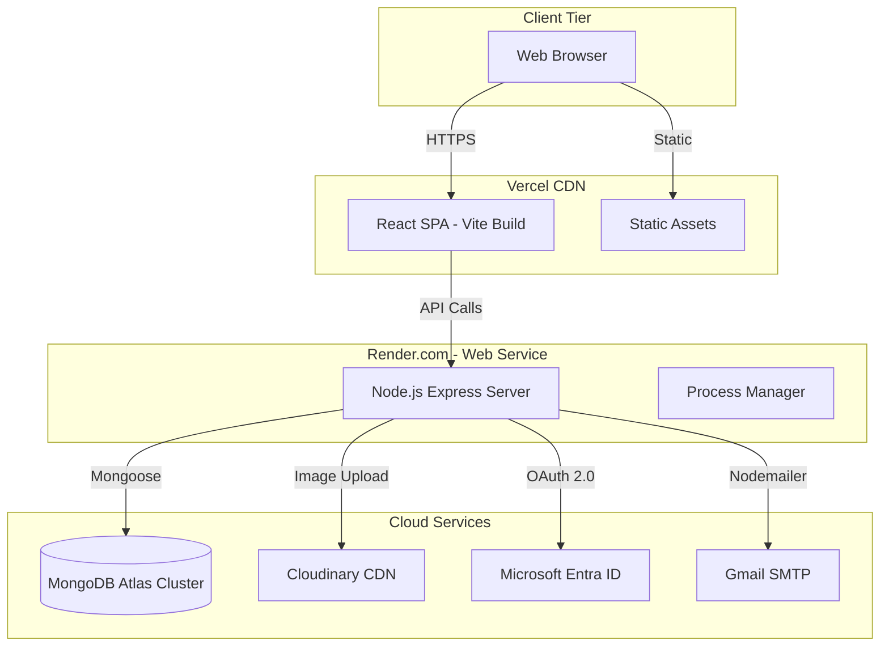

---

## 2.4 Object Diagram

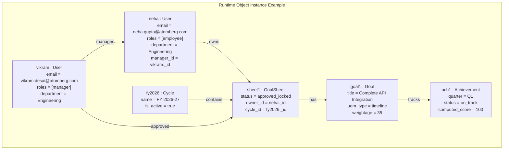

---

## 2.5 Package Diagram

```mermaid
graph TB
    subgraph "Frontend Package - src/"
        subgraph "routes/"
            R1[__root.tsx]
            R2[login.tsx]
            R3[first-login.tsx]
            R4[_app/dashboard.tsx]
            R5[_app/goals.tsx]
            R6[_app/checkins.tsx]
            R7[_app/profile.tsx]
            R8[_app/reports.tsx]
            R9[_app/goals_.review.tsx]
            R10[_app/admin/*]
        end
        subgraph "lib/"
            L1[api.ts]
            L2[auth-context.tsx]
            L3[scoring.ts]
            L4[goals.functions.ts]
            L5[admin.functions.ts]
            L6[cycles.functions.ts]
        end
        subgraph "components/"
            C1[app/AppShell.tsx]
            C2[app/EmptyState.tsx]
            C3[ui/*]
        end
    end

    subgraph "Backend Package - backend/"
        subgraph "models/"
            M1[User.js]
            M2[GoalSheet.js]
            M3[Goal.js]
            M4[Achievement.js]
            M5[Comment.js]
            M6[AuditLog.js]
            M7[Cycle.js]
            M8[Escalation.js]
        end
        subgraph "routes/"
            BR1[auth.js]
            BR2[users.js]
            BR3[sheets.js]
            BR4[goals.js]
            BR5[achievements.js]
            BR6[cycles.js]
            BR7[audit.js]
            BR8[entra.js]
        end
        subgraph "middleware/"
            MW1[auth.js - protect / requireRole]
        end
        subgraph "utils/"
            UT1[scoreEngine.js]
            UT2[notificationService.js]
            UT3[validation.js]
        end
        subgraph "config/"
            CF1[db.js]
        end
    end

    L1 --> BR1
    L1 --> BR3
    R4 --> L4
    BR3 --> M2
    BR3 --> UT2
    BR5 --> UT1
```

---

## 2.6 Composite Structure & Profile Diagram

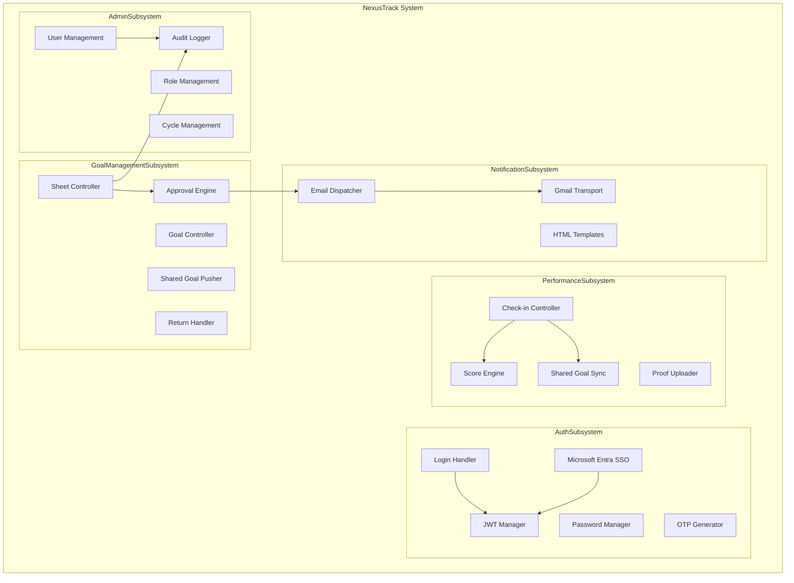

---

## 2.7 Use Case Diagram

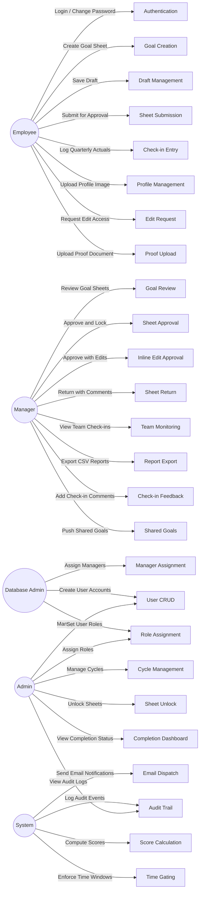

---

## 2.8 Activity Diagram

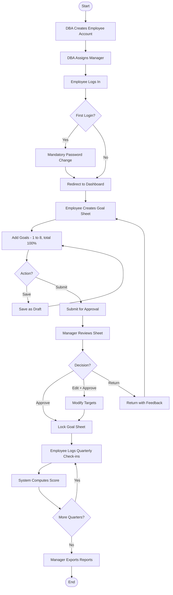

---

## 2.9 State Machine Diagram

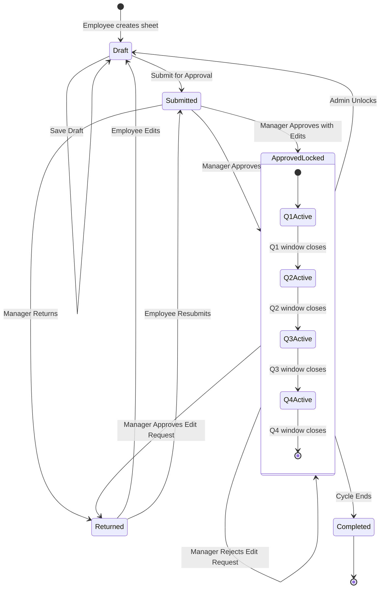

---

## 2.10 Sequence Diagram

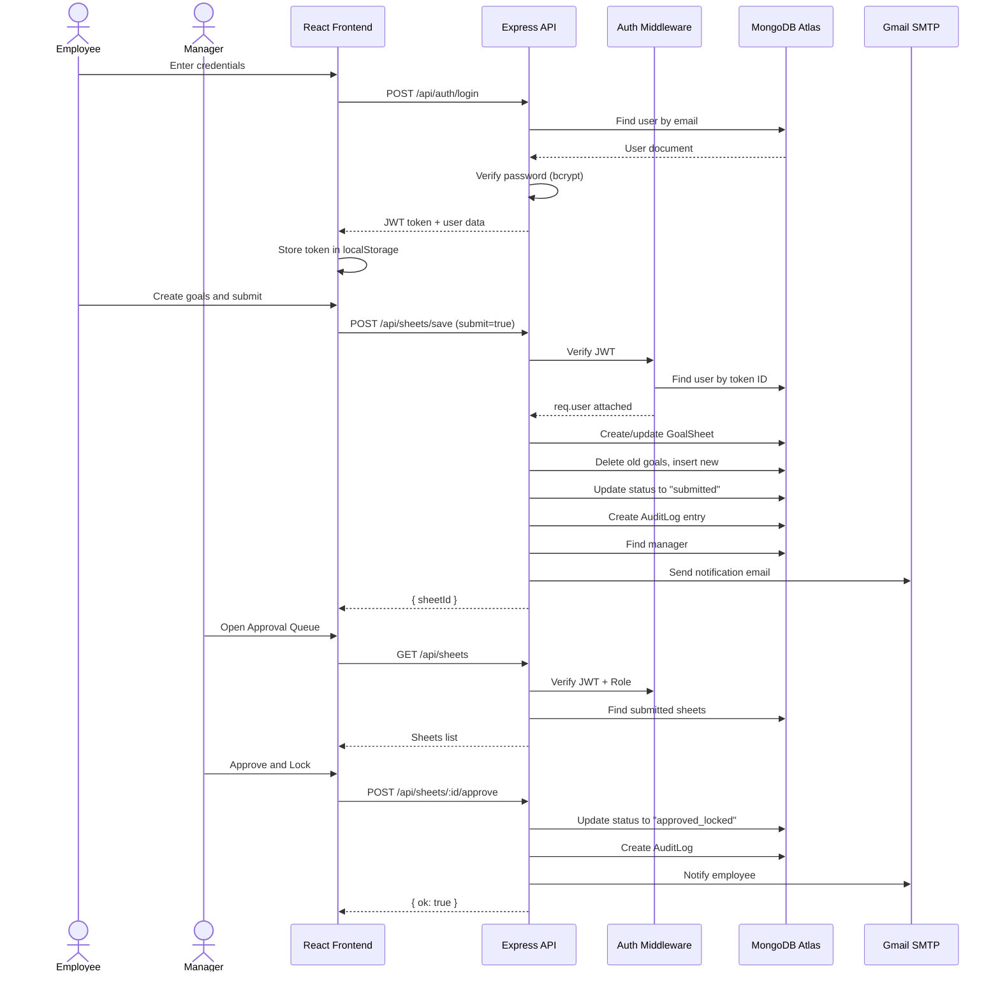

---

## 2.11 Communication Diagram

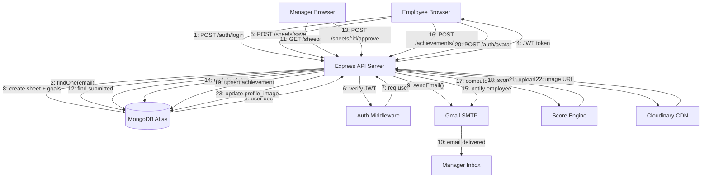

---

## 2.12 Timing Diagram

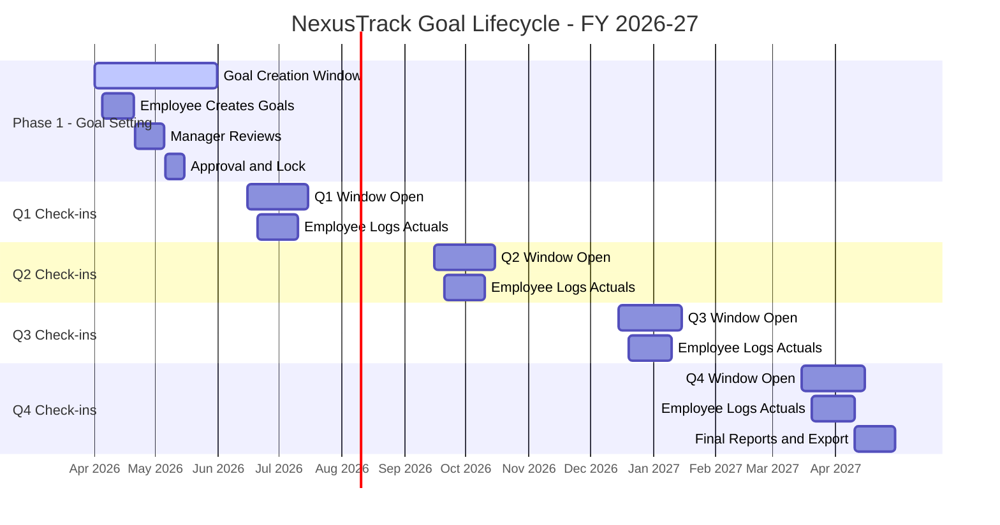

---

## 2.13 Application Logic Flowchart

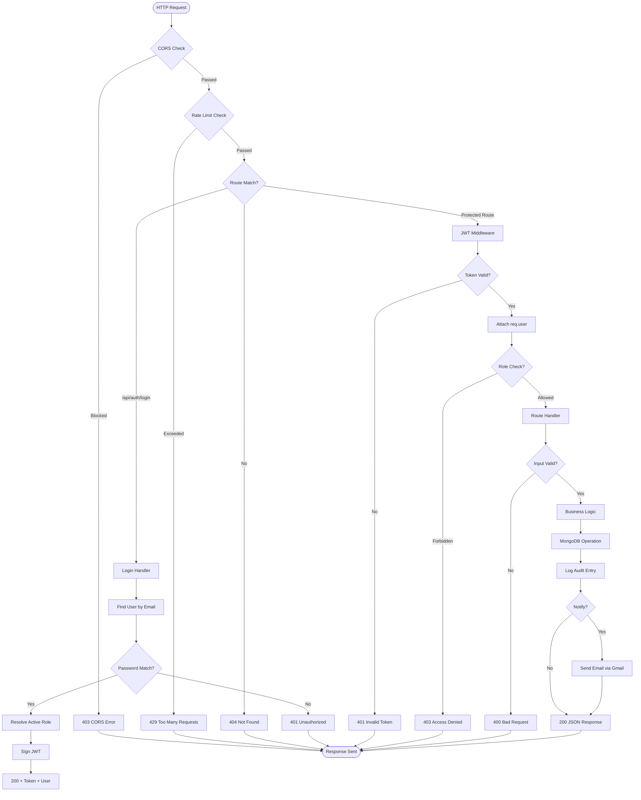

---

## 2.14 C4 Model

### Level 1 — System Context

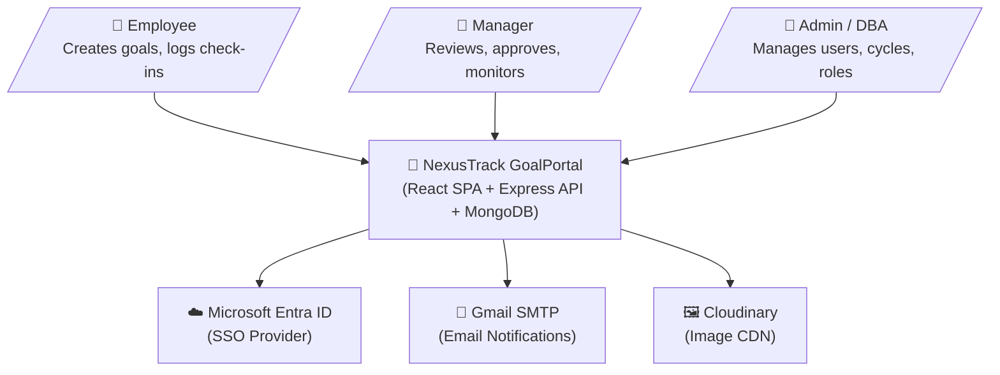

### Level 2 — Container

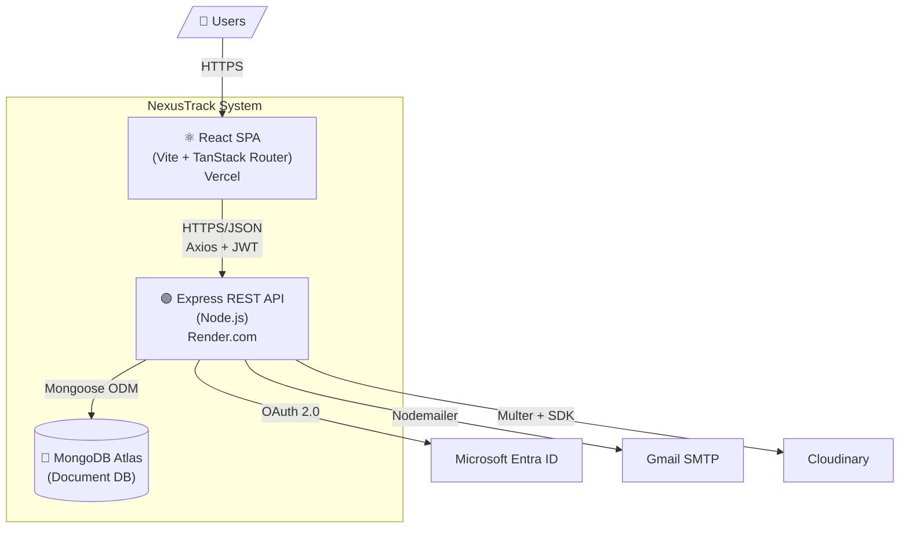

### Level 3 — Component (API Server)

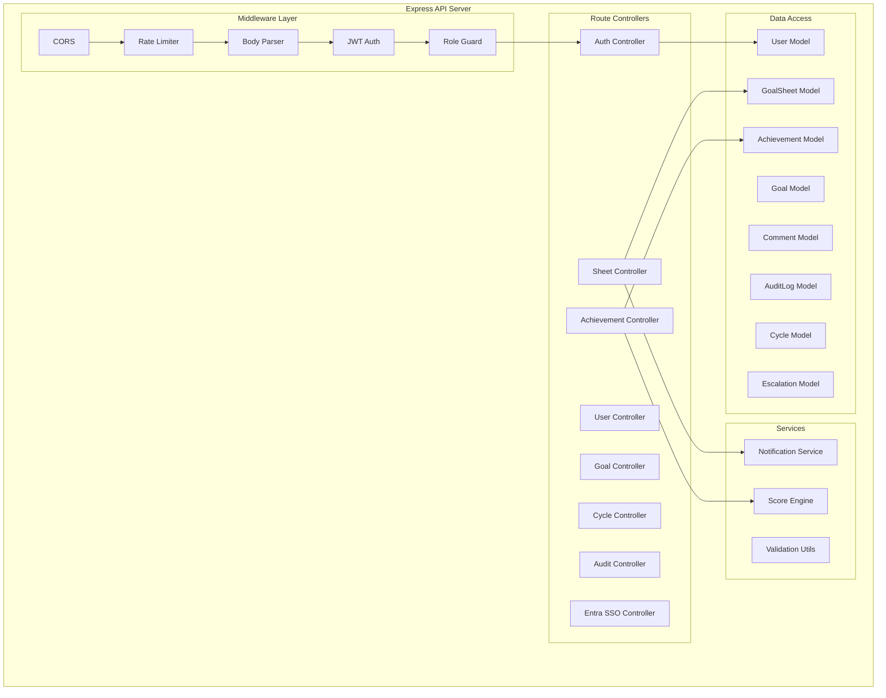

---

## 2.15 Architecture Pattern

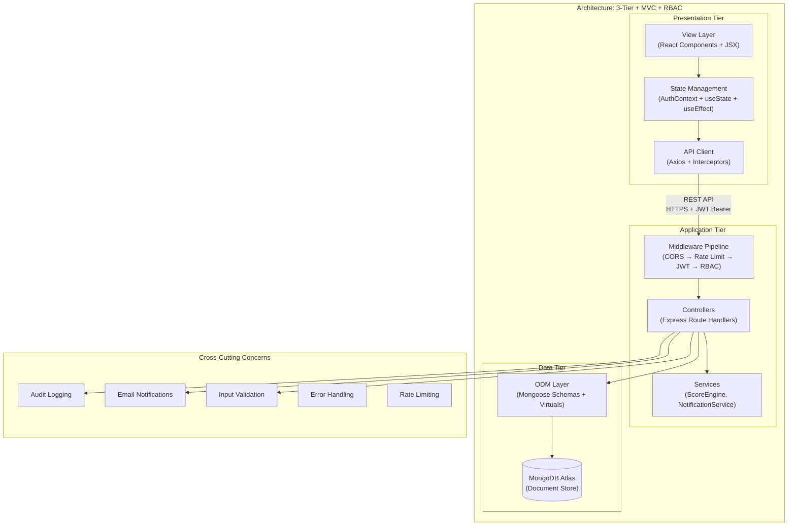

### Architecture Patterns Summary

| Pattern | Implementation |
|---------|---------------|
| **3-Tier Architecture** | React SPA → Express API → MongoDB Atlas |
| **MVC** | Models (Mongoose) · Views (React) · Controllers (Express Routes) |
| **RBAC** | 4 roles: Employee, Manager, Admin, Database Admin with middleware guards |
| **Repository Pattern** | Mongoose models abstract database access |
| **Middleware Pipeline** | CORS → Rate Limit → Body Parser → JWT Verify → Role Check → Handler |
| **Observer Pattern** | Email notifications triggered on state transitions (submit, approve, return) |
| **Strategy Pattern** | Score Engine uses different algorithms per UOM type (numeric, timeline, zero) |
| **Singleton** | Single Mongoose connection, single Axios instance with interceptors |
| **State Machine** | GoalSheet lifecycle: Draft → Submitted → Approved/Returned → Completed |
| **Time Gating** | Cycle-based quarter windows enforce check-in availability |
| **SSO Integration** | Microsoft Entra ID OAuth 2.0 Authorization Code flow |
| **CDN Offloading** | Profile images stored via Cloudinary with auto-transformation |

---

*Document generated on May 19, 2026 — NexusTrack GoalPortal v1.0*
